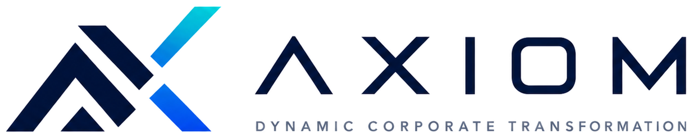

AXIOM is the enterprise-optimization laboratory of the DCT ecosystem. Every chapter is
instrumented by one or more AXIOM modules; the chapter page links its modules directly.

The canonical workflow, for every chapter:

**Launch AXIOM → Load Chapter Model → Modify Inputs → Run Optimization → Visualize
Results → Download Report**

[Open the AXIOM WebApp →](https://axiomdynamics.app){.btn-hero}

| Module | Instruments | Chapters |
|---|---|---|
| AXIOM-01–04 | Foundations: state inspectors, modeling benches | I.1–4, II.1–4 |
| AXIOM-05–08 | Dynamics: trajectories, stability, stochastic fans | I.5–8, II.5–8 |
| AXIOM-09–12 | Architectures & robust optimization | I.9–12, II.9–12 |
| AXIOM-13–16 | Integration, ML/AI, digital twins, cases | I.13–16, II.13–16 |
